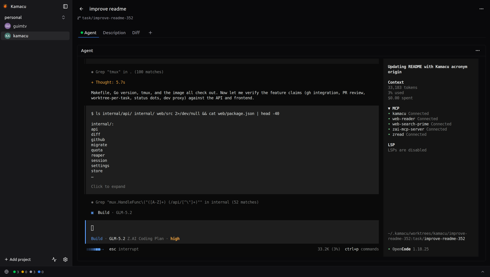

# Kamacu

A local-only, agent-agnostic web app for organizing coding-agent sessions around
projects and tasks. Claude Code and OpenCode are supported natively, and any other
terminal-driven agent can be added as a custom agent. The name is an acronym:
**KA**nban **M**ulti-**A**gent **C**ontrol **U**nit —
Kamacu is the control unit that drives your kanban of parallel agents, and the
ember-spark logo is that animating force made visible.



## What it is

A left sidebar lists your projects, each pointing at a local git repo checkout. The main
area is a kanban board of tasks. Click a task to expand a full-page view with the main
agent session — the agent's real CLI running in a PTY, rendered live in a browser
terminal — plus optional tabs for extra bash sessions. Claude Code and OpenCode are
built in, with live working/idle/waiting status on the board; any other CLI agent can
be registered as a custom agent from just a name and a command. The default agent is
configurable per project.

It runs entirely on your machine, single user, accessed from a browser at localhost. The
whole point is one place to see and drive all your agent work: every task gets its own
isolated git worktree and a persistent agent session you can open, leave, and
reattach to from any browser tab.

## Prerequisites

- **An agent CLI** — Kamacu spawns the real agent CLI in a terminal; it never
  reimplements it. Claude Code and OpenCode are supported natively: install the one(s)
  you use and sign in first. Any other terminal agent works too, registered as a
  custom agent.
- **git** — every task runs in its own git worktree off your project's checkout.
- **tmux** — backs the durable bash tabs so sessions survive server restarts.

## Install

Kamacu ships as one self-contained binary (Go server with the React frontend
embedded) for Linux and macOS, amd64 and arm64, published on the
[releases page](https://github.com/jordeu/kamacu/releases). The easiest way to
install it — or update an existing install — is to paste this line to your
coding agent:

```
read https://raw.githubusercontent.com/jordeu/kamacu/master/docs/install.md and install kamacu
```

The guide, [docs/install.md](docs/install.md), is written to be executed by the
agent: it downloads the latest release for your platform, verifies its
checksum, installs to `~/.local/bin` (or updates an existing binary in place),
and asks whether `kamacu serve` should run as a background service at boot
(systemd user unit on Linux, LaunchAgent on macOS) or be started manually.

Once installed, start it (or let the service do it) and open
http://127.0.0.1:7333 in a browser.

### Development

To build from a checkout instead (requires Go 1.26 and Node 20.19+/22.12+):

```sh
make build           # Vite production build, then the Go binary → bin/kamacu
./bin/kamacu serve
```

`make build` embeds the frontend into the binary — no separate frontend server
in production. For frontend development with hot-reload, run `make dev-backend`
and `make dev-frontend` (Vite dev server with HMR, proxying `/api` — the JSON
API and WebSocket terminal streams — to the backend).

## MCP server

Kamacu also exposes its API as a stdio MCP server, so coding agents can drive
the board (projects, tasks, reviews) directly. Install it by pasting this line
to your agent:

```
read https://raw.githubusercontent.com/jordeu/kamacu/master/docs/install-mcp.md and install the Kamacu MCP server for yourself
```

The guide, [docs/install-mcp.md](docs/install-mcp.md), is written to be
executed by the agent: it checks prerequisites, registers the server with the
agent's client, and verifies the install with a real tool call.

## The workflow

Kamacu drives one loop, from an idea to a reviewed change:

1. **Project** — add a project that points at a local git repo checkout. It shows up in
   the sidebar with its own kanban board.
2. **Task** — create a task on the board. Kamacu auto-creates a branch and an isolated
   git worktree for it, so concurrent tasks never collide in one checkout.
3. **Agent** — open the task and start an agent session. It runs as the real CLI —
   `claude`, `opencode`, or a custom agent's command — inside the task's worktree,
   with the full interactive TUI (plan mode, slash commands, permission prompts).
   Leave the tab and reattach later — the session keeps running server-side and
   replays on reconnect.
4. **Review** — watch the board as a dispatcher: status dots tell you which agents are
   working, idle, or waiting on you. When an agent is done, review the diff against the
   base branch, then merge or open a PR. Incoming PRs work too: link a repo and Kamacu
   lists PRs awaiting your review, each one opening in its own detached PR-head
   worktree so you can review and approve without leaving the board.

## Scope

Kamacu is a web app by design — a single Go binary plus your browser, no desktop
packaging, no external services, and no stored credentials (GitHub access, when enabled,
rides your already-authenticated `gh` CLI). All project and task state lives in a local
SQLite database.
