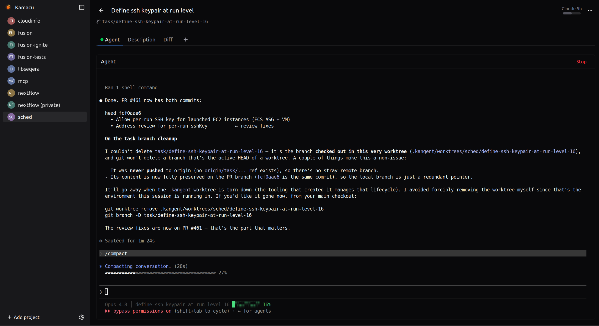

# Kamacu

A local-only web app for organizing Claude Code agent sessions around projects and
tasks. The name is an acronym: **K**Anban **M**ulti-**A**gent **C**ontrol **U**nit —
Kamacu is the control unit that drives your kanban of parallel agents, and the
ember-spark logo is that animating force made visible.



## What it is

A left sidebar lists your projects, each pointing at a local git repo checkout. The main
area is a kanban board of tasks. Click a task to expand a full-page view with the main
agent session — the real `claude` CLI running in a PTY, rendered live in a browser
terminal — plus optional tabs for extra bash sessions. Claude Code is the default agent;
other CLI agents can be configured per project.

It runs entirely on your machine, single user, accessed from a browser at localhost. The
whole point is one place to see and drive all your agent work: every task gets its own
isolated git worktree and a persistent Claude Code session you can open, leave, and
reattach to from any browser tab.

## Prerequisites

- **Claude Code CLI** — Kamacu spawns the real `claude` CLI in a terminal; it never
  reimplements it. Install it and sign in first.
- **git** — every task runs in its own git worktree off your project's checkout.
- **Go 1.26** — to build the single backend binary.
- **Node 20.19+ / 22.12+** — to build the React frontend (Vite's minimum).
- **tmux** — backs the durable bash tabs so sessions survive server restarts.

## Build & run

Kamacu ships as one self-contained binary that serves the JSON API and the embedded
frontend together at localhost:

```sh
make build      # builds the React frontend, then the Go binary → bin/kamacu
./bin/kamacu    # starts the server; open the printed localhost URL in a browser
```

`make build` runs the Vite production build and embeds the output into a single
`bin/kamacu` binary — no separate frontend server to run in production.

For frontend development with hot-reload, run the Vite dev server and let it proxy
`/api` (JSON API and WebSocket terminal streams) through to a locally running
backend:

```sh
make dev-backend    # Go server on its own port
make dev-frontend   # Vite dev server with HMR, proxying API + WebSocket to the backend
```

## The workflow

Kamacu drives one loop, from an idea to a reviewed change:

1. **Project** — add a project that points at a local git repo checkout. It shows up in
   the sidebar with its own kanban board.
2. **Task** — create a task on the board. Kamacu auto-creates a branch and an isolated
   git worktree for it, so concurrent tasks never collide in one checkout.
3. **Agent** — open the task and Start a Claude Code session. It runs as the real
   `claude` CLI inside the task's worktree, with the full interactive TUI (plan mode,
   slash commands, permission prompts). Leave the tab and reattach later — the session
   keeps running server-side and replays on reconnect.
4. **Review** — watch the board as a dispatcher: status dots tell you which agents are
   working, idle, or waiting on you. When an agent is done, review the diff against the
   base branch, then merge or open a PR. Incoming PRs work too: link a repo and Kamacu
   lists PRs awaiting your review, each one opening in its own detached PR-head
   worktree so you can review and approve without leaving the board.

## Scope

Kamacu is a web app by design — a single Go binary plus your browser, no desktop
packaging, no external services, and no stored credentials (GitHub access, when enabled,
rides your already-authenticated `gh` CLI). All project and task state lives in a local
SQLite database.
